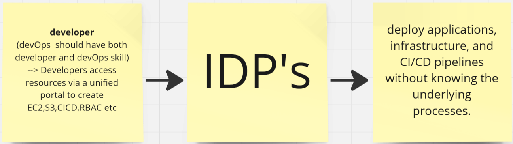

# Platform Engineering
Platform engineering involves setting up internal developer platforms (IDPs) to make developers self-sufficient.
Developers can deploy applications, infrastructure, and CI/CD pipelines without knowing the underlying processes.

The goal is to reduce dependency on DevOps teams and streamline workflows.

## Traditional DevOps Challenges
Developers rely on ticketing systems like Jira for infrastructure requests.These requests often face delays due to overloaded DevOps teams.Platform engineering aims to automate these processes through developer portals.

## Internal Developer Portals
Developers access resources via a unified portal.

Features include:

Automated infrastructure provisioning (e.g., EC2 instances, S3 buckets).

CI/CD pipeline execution.

Role-based access control (RBAC) to restrict or grant permissions.

Developers interact via user-friendly options like dropdowns and radio buttons.

